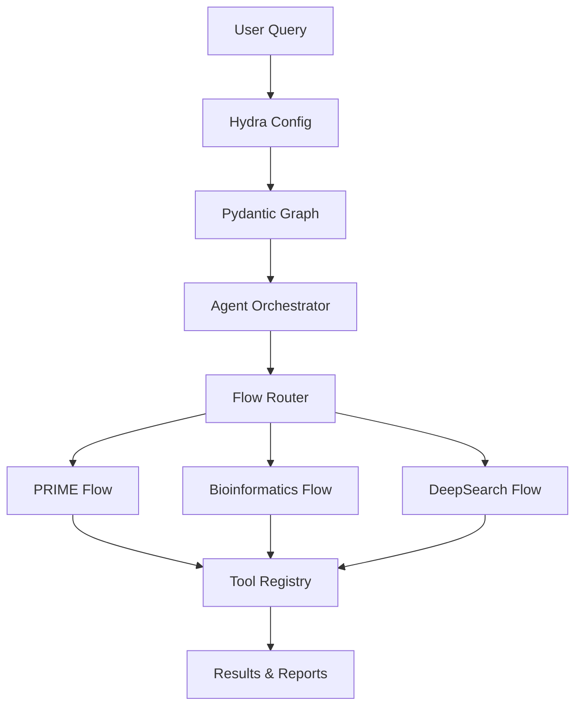

# Architecture Overview

DeepCritical is built on a sophisticated architecture that combines multiple cutting-edge technologies to create a powerful research automation platform.

## Core Architecture



## Key Components

### 1. Hydra Configuration Layer

**Purpose**: Flexible, composable configuration management

**Key Features**:
- Hierarchical configuration composition
- Command-line overrides
- Environment variable interpolation
- Configuration validation

**Files**:
- `configs/config.yaml` - Main configuration
- `configs/statemachines/flows/` - Flow-specific configs
- `configs/prompts/` - Agent prompt templates

### 2. Pydantic Graph Workflow Engine

**Purpose**: Stateful workflow execution with type safety

**Key Features**:
- Type-safe state management
- Graph-based workflow definition
- Error handling and recovery
- Execution history tracking

**Core Classes**:
- `ResearchState` - Main workflow state
- `BaseNode` - Workflow node base class
- `GraphRunContext` - Execution context

### 3. Agent Orchestrator

**Purpose**: Multi-agent coordination and execution

**Key Features**:
- Specialized agents for different tasks
- Pydantic AI integration
- Tool registration and management
- Context passing between agents

**Agent Types**:
- `ParserAgent` - Query parsing and analysis
- `PlannerAgent` - Workflow planning
- `ExecutorAgent` - Tool execution
- `EvaluatorAgent` - Result evaluation

### 4. Flow Router

**Purpose**: Dynamic flow selection and composition

**Key Features**:
- Conditional flow activation
- Flow composition based on requirements
- Cross-flow state sharing
- Flow-specific optimizations

**Available Flows**:
- **PRIME Flow**: Protein engineering workflows
- **Bioinformatics Flow**: Data fusion and reasoning
- **DeepSearch Flow**: Web research automation
- **Challenge Flow**: Experimental workflows

### 5. Tool Registry

**Purpose**: Extensible tool ecosystem

**Key Features**:
- 65+ specialized tools across categories
- Tool validation and testing
- Mock implementations for development
- Performance monitoring

**Tool Categories**:
- Knowledge Query
- Sequence Analysis
- Structure Prediction
- Molecular Docking
- De Novo Design
- Function Prediction

## Data Flow

### Query Processing

1. **Input**: User provides research question
2. **Parsing**: Query parsed for intent and requirements
3. **Planning**: Workflow plan generated based on query type
4. **Routing**: Appropriate flows selected and configured
5. **Execution**: Tools executed with proper error handling
6. **Synthesis**: Results combined into coherent output

### State Management

```python
@dataclass
class ResearchState:
    """Main workflow state"""
    question: str
    plan: List[str]
    agent_results: Dict[str, Any]
    tool_outputs: Dict[str, Any]
    execution_history: ExecutionHistory
    config: DictConfig
    metadata: Dict[str, Any]
```

### Error Handling

- **Strategic Recovery**: Tool substitution when failures occur
- **Tactical Recovery**: Parameter adjustment for better results
- **Execution History**: Comprehensive failure tracking
- **Graceful Degradation**: Continue with available data

## Integration Points

### External Systems

- **Vector Databases**: ChromaDB, Qdrant for RAG
- **Bioinformatics APIs**: UniProt, PDB, PubMed
- **Search Engines**: Google, DuckDuckGo, Bing
- **Model Providers**: OpenAI, Anthropic, local models

### Internal Systems

- **Configuration Management**: Hydra-based
- **State Persistence**: JSON/YAML serialization
- **Logging**: Structured logging with metadata
- **Monitoring**: Execution metrics and performance

## Performance Characteristics

### Scalability

- **Horizontal Scaling**: Agent pools for high throughput
- **Vertical Scaling**: Optimized for large workflows
- **Resource Management**: Memory and CPU optimization

### Reliability

- **Error Recovery**: Comprehensive retry mechanisms
- **State Consistency**: ACID properties for workflow state
- **Monitoring**: Real-time health and performance metrics

## Security Considerations

- **Input Validation**: All inputs validated using Pydantic
- **API Security**: Secure API key management
- **Data Protection**: Sensitive data encryption
- **Access Control**: Configurable permission systems

## Extensibility

### Adding New Flows

1. Create flow configuration in `configs/statemachines/flows/`
2. Implement flow nodes in appropriate modules
3. Register flow in main graph composition
4. Add flow documentation

### Adding New Tools

1. Define tool specification with input/output schemas
2. Implement tool runner class
3. Register tool in global registry
4. Add tool tests and documentation

### Adding New Agents

1. Create agent class inheriting from base agent
2. Define agent dependencies and context
3. Register agent in orchestrator
4. Add agent-specific prompts and configuration

This architecture provides a solid foundation for building sophisticated research automation systems while maintaining flexibility, reliability, and extensability.
