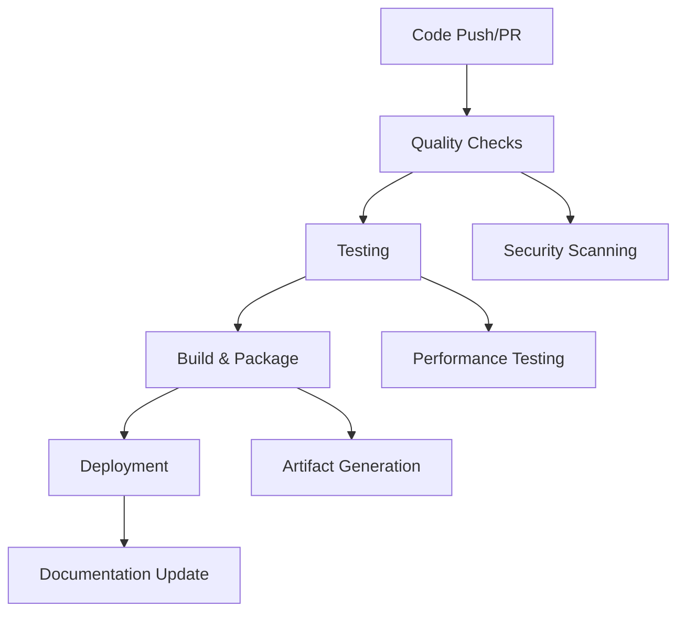

# CI/CD Guide

This guide explains the Continuous Integration and Continuous Deployment setup for DeepCritical, including automated testing, quality checks, and deployment processes.

## CI/CD Pipeline Overview

DeepCritical uses GitHub Actions for comprehensive CI/CD automation:



## GitHub Actions Workflows

### Main CI Workflow (`.github/workflows/ci.yml`)
```yaml
name: CI

on:
  push:
    branches: [ main, dev ]
  pull_request:
    branches: [ main, dev ]

jobs:
  test:
    runs-on: ubuntu-latest
    steps:
      - uses: actions/checkout@v4
      - uses: actions/setup-python@v4
        with:
          python-version: '3.11'
      - name: Install dependencies
        run: |
          python -m pip install --upgrade pip
          pip install -e .
          pip install -e ".[dev]"
      - name: Run tests
        run: make test
      - name: Upload coverage
        uses: codecov/codecov-action@v3

  lint:
    runs-on: ubuntu-latest
    steps:
      - uses: actions/checkout@v4
      - uses: actions/setup-python@v4
        with:
          python-version: '3.11'
      - name: Run linting
        run: make lint

  types:
    runs-on: ubuntu-latest
    steps:
      - uses: actions/checkout@v4
      - uses: actions/setup-python@v4
        with:
          python-version: '3.11'
      - name: Run type checking
        run: make type-check
```

### Documentation Deployment (`.github/workflows/docs.yml`)
```yaml
name: Documentation

on:
  push:
    branches: [ main, dev ]
    paths:
      - 'docs/**'
      - 'mkdocs.yml'

jobs:
  build:
    runs-on: ubuntu-latest
    steps:
      - uses: actions/checkout@v4
      - uses: actions/setup-python@v4
        with:
          python-version: '3.11'
      - name: Install MkDocs
        run: pip install mkdocs mkdocs-material
      - name: Build documentation
        run: mkdocs build

  deploy:
    needs: build
    if: github.ref == 'refs/heads/main'
    steps:
      - name: Deploy to GitHub Pages
        uses: actions/deploy-pages@v4
```

## Quality Assurance Pipeline

### Code Quality Checks
```bash
# Automated quality checks run on every PR
make quality

# Individual quality tools
make lint      # Ruff linting
make format    # Code formatting (Black + Ruff)
make type-check # Type checking (ty)
```

### Security Scanning
```yaml
# Security scanning in CI
- name: Security scan
  run: |
    pip install bandit
    bandit -r DeepResearch/ -c pyproject.toml
```

### Dependency Scanning
```yaml
# Dependabot configuration
- name: Dependency check
  run: |
    pip install safety
    safety check
```

## Testing Pipeline

### Test Execution
```yaml
# Comprehensive testing
- name: Run tests
  run: |
    make test
    make test-cov

# VLLM-specific tests (optional)
- name: VLLM tests
  if: contains(github.event.head_commit.message, '[vllm-tests]')
  run: make vllm-test
```

### Test Matrix
```yaml
# Multi-version testing
strategy:
  matrix:
    python-version: ['3.10', '3.11']
    os: [ubuntu-latest, windows-latest, macos-latest]

steps:
  - uses: actions/setup-python@v4
    with:
      python-version: ${{ matrix.python-version }}
  - name: Install dependencies
    run: |
      python -m pip install --upgrade pip
      pip install -e .
      pip install -e ".[dev]"
  - name: Run tests
    run: make test
```

## Deployment Pipeline

### Package Publishing
```yaml
# PyPI publishing workflow
name: Release

on:
  release:
    types: [published]

jobs:
  deploy:
    runs-on: ubuntu-latest
    steps:
      - uses: actions/checkout@v4
      - uses: actions/setup-python@v4
        with:
          python-version: '3.11'
      - name: Build package
        run: python -m build
      - name: Publish to PyPI
        uses: pypa/gh-action-pypi-publish@release/v1
        with:
          password: ${{ secrets.PYPI_API_TOKEN }}
```

### Documentation Deployment
```yaml
# Automatic documentation deployment
name: Deploy Documentation

on:
  push:
    branches: [ main ]
    paths: [ 'docs/**', 'mkdocs.yml' ]

jobs:
  deploy:
    runs-on: ubuntu-latest
    steps:
      - uses: actions/checkout@v4
      - name: Setup Pages
        uses: actions/configure-pages@v4
      - name: Build with MkDocs
        run: |
          pip install mkdocs mkdocs-material
          mkdocs build
      - name: Upload artifact
        uses: actions/upload-pages-artifact@v3
        with:
          path: ./site
      - name: Deploy to GitHub Pages
        id: deployment
        uses: actions/deploy-pages@v4
```

## Environment Management

### Development Environment
```yaml
# Development environment configuration
name: Development

on:
  push:
    branches: [ dev, feature/* ]

env:
  ENVIRONMENT: development
  DEBUG: true
  LOG_LEVEL: DEBUG

jobs:
  test:
    runs-on: ubuntu-latest
    environment: development
    steps:
      - uses: actions/checkout@v4
      - name: Development testing
        run: |
          make test
          make quality
```

### Production Environment
```yaml
# Production environment configuration
name: Production

on:
  push:
    branches: [ main ]
    tags: [ 'v*' ]

env:
  ENVIRONMENT: production
  LOG_LEVEL: INFO

jobs:
  deploy:
    runs-on: ubuntu-latest
    environment: production
    steps:
      - uses: actions/checkout@v4
      - name: Production deployment
        run: |
          make test
          make build
          # Deploy to production
```

## Monitoring and Alerts

### CI/CD Monitoring
```yaml
# Monitoring configuration
- name: Monitor build
  uses: action-monitor-build@v1
  with:
    github-token: ${{ secrets.GITHUB_TOKEN }}
    slack-webhook: ${{ secrets.SLACK_WEBHOOK }}

# Alert on failures
- name: Alert on failure
  if: failure()
  uses: action-slack-notification@v1
  with:
    webhook-url: ${{ secrets.SLACK_WEBHOOK }}
    message: "Build failed: ${{ github.workflow }}/${{ github.job }}"
```

### Performance Monitoring
```yaml
# Performance tracking
- name: Performance monitoring
  run: |
    # Track build times
    echo "BUILD_TIME=$(date +%s)" >> $GITHUB_ENV

    # Track test coverage
    make test-cov
    coverage report --format=markdown >> $GITHUB_STEP_SUMMARY
```

## Branch Protection

### Protected Branches
```yaml
# Branch protection rules
branches:
  - name: main
    protection:
      required_status_checks:
        contexts: [ci, lint, test, types]
      required_reviews: 1
      dismiss_stale_reviews: true
      require_up_to_date_branches: true

  - name: dev
    protection:
      required_status_checks:
        contexts: [ci, lint, test]
      required_reviews: 0
```

## Release Management

### Automated Releases
```yaml
# Release workflow
name: Release

on:
  push:
    tags: [ 'v*' ]

jobs:
  release:
    runs-on: ubuntu-latest
    steps:
      - uses: actions/checkout@v4
      - name: Create release
        uses: actions/create-release@v1
        with:
          tag_name: ${{ github.ref }}
          release_name: Release ${{ github.ref }}
          body: |
            ## Changes

            See [CHANGELOG.md](CHANGELOG.md) for details.

            ## Installation

            ```bash
            pip install deepcritical==${{ github.ref }}
            ```
```

### Changelog Generation
```yaml
# Automatic changelog updates
- name: Update changelog
  run: |
    # Generate changelog entries
    echo "## [${{ github.ref }}] - $(date +%Y-%m-%d)" >> CHANGELOG.md
    echo "" >> CHANGELOG.md
    echo "### Added" >> CHANGELOG.md
    echo "- New features..." >> CHANGELOG.md
```

## Best Practices

### 1. Fast Feedback
- Run critical tests first
- Use caching for dependencies
- Parallelize independent jobs
- Fail fast on critical issues

### 2. Reliable Builds
```yaml
# Use specific versions for reliability
- uses: actions/checkout@v4  # Specific version
- uses: actions/setup-python@v4
  with:
    python-version: '3.11'  # Specific version
```

### 3. Security
```yaml
# Security best practices
- name: Security scan
  run: |
    pip install bandit safety
    bandit -r DeepResearch/
    safety check

# Dependency vulnerability scanning
- name: Dependency audit
  uses: dependency-review-action@v3
```

### 4. Performance
```yaml
# Performance optimization
- name: Cache dependencies
  uses: actions/cache@v3
  with:
    path: ~/.cache/pip
    key: ${{ runner.os }}-pip-${{ hashFiles('**/pyproject.toml') }}

# Parallel execution
strategy:
  matrix:
    python-version: ['3.10', '3.11']
  fail-fast: false
```

## Troubleshooting

### Common CI/CD Issues

**Flaky Tests:**
```yaml
# Retry configuration for flaky tests
- name: Run tests with retry
  uses: nick-invision/retry@v2
  with:
    timeout_minutes: 10
    max_attempts: 3
    command: make test
```

**Build Timeouts:**
```yaml
# Optimize for speed
- name: Fast testing
  run: |
    export PYTEST_DISABLE_PLUGIN_AUTOLOAD=1
    make test-fast
```

**Memory Issues:**
```yaml
# Memory optimization
- name: Memory efficient testing
  run: |
    export PYTHONOPTIMIZE=1
    make test
```

### Debugging Failed Builds
```yaml
# Debug mode for troubleshooting
- name: Debug build
  if: failure()
  run: |
    echo "Build failed, collecting debug info"
    make quality --verbose
    python -c "import deepresearch; print('Import successful')"
```

## Local Development Setup

### Pre-commit Hooks
```bash
# Install pre-commit hooks
make pre-install

# Run hooks manually
make pre-commit

# Skip hooks for specific commit
git commit --no-verify -m "chore: temporary skip"
```

### Local Testing
```bash
# Run full test suite locally
make test

# Run specific test categories
make test unit_tests
make test integration_tests

# Run performance tests
make test performance_tests
```

## Integration with External Services

### Code Coverage (Codecov)
```yaml
# Codecov integration
- name: Upload coverage to Codecov
  uses: codecov/codecov-action@v3
  with:
    file: ./coverage.xml
    fail_ci_if_error: true
    verbose: true
```

### Dependency Management (Dependabot)
```yaml
# Dependabot configuration
version: 2
updates:
  - package-ecosystem: "pip"
    directory: "/"
    schedule:
      interval: "weekly"
    reviewers:
      - "@deepcritical/maintainers"
```

### Security Scanning (Snyk)
```yaml
# Snyk security scanning
- name: Run Snyk to check for vulnerabilities
  uses: snyk/actions/python@master
  env:
    SNYK_TOKEN: ${{ secrets.SNYK_TOKEN }}
  with:
    args: --severity-threshold=high
```

## Performance Optimization

### Build Caching
```yaml
# Comprehensive caching strategy
- uses: actions/cache@v3
  with:
    path: |
      ~/.cache/pip
      ~/.cache/uv
      ~/.cache/pre-commit
      ~/.cache/mypy
    key: ${{ runner.os }}-${{ hashFiles('**/pyproject.toml', '**/poetry.lock') }}
    restore-keys: |
      ${{ runner.os }}-
```

### Parallel Execution
```yaml
# Parallel job execution
jobs:
  test:
    strategy:
      matrix:
        python-version: ['3.10', '3.11']
        test-category: ['unit', 'integration', 'performance']

    steps:
      - uses: actions/checkout@v4
      - name: Run ${{ matrix.test-category }} tests
        run: make test ${{ matrix.test-category }}_tests
```

## Deployment Strategies

### Staged Deployment
```yaml
# Multi-stage deployment
jobs:
  test:
    # Run tests first

  build:
    needs: test
    # Build artifacts

  deploy-staging:
    needs: build
    environment: staging
    # Deploy to staging

  deploy-production:
    needs: deploy-staging
    environment: production
    # Deploy to production after staging validation
```

### Rollback Strategy
```yaml
# Rollback capability
- name: Rollback on failure
  if: failure()
  run: |
    # Implement rollback logic
    echo "Rolling back to previous version"
    # Rollback commands here
```

## Monitoring and Observability

### Build Metrics
```yaml
# Collect build metrics
- name: Collect metrics
  run: |
    echo "BUILD_DURATION=$(( $(date +%s) - $START_TIME ))" >> $GITHUB_ENV
    echo "TEST_COUNT=$(find tests/ -name "*.py" | wc -l)" >> $GITHUB_ENV
    echo "COVERAGE_PERCENTAGE=$(coverage report | grep TOTAL | awk '{print $4}')" >> $GITHUB_ENV
```

### Alert Configuration
```yaml
# Alert thresholds
- name: Check thresholds
  run: |
    if [ "$BUILD_DURATION" -gt 1800 ]; then  # 30 minutes
      echo "Build too slow" >&2
      exit 1
    fi

    if [ "$(echo $COVERAGE_PERCENTAGE | cut -d'%' -f1)" -lt 80 ]; then
      echo "Coverage below threshold" >&2
      exit 1
    fi
```

## Best Practices Summary

1. **Automation First**: Automate everything possible
2. **Fast Feedback**: Provide quick feedback on changes
3. **Reliable Builds**: Ensure builds are consistent and reliable
4. **Security Focus**: Include security scanning in every build
5. **Performance Monitoring**: Track build and test performance
6. **Rollback Planning**: Plan for deployment failures
7. **Documentation**: Keep CI/CD processes well documented

For more detailed information about specific CI/CD components, see the [Makefile Documentation](../development/makefile-usage.md) and [Pre-commit Hooks Guide](../development/pre-commit-hooks.md).
