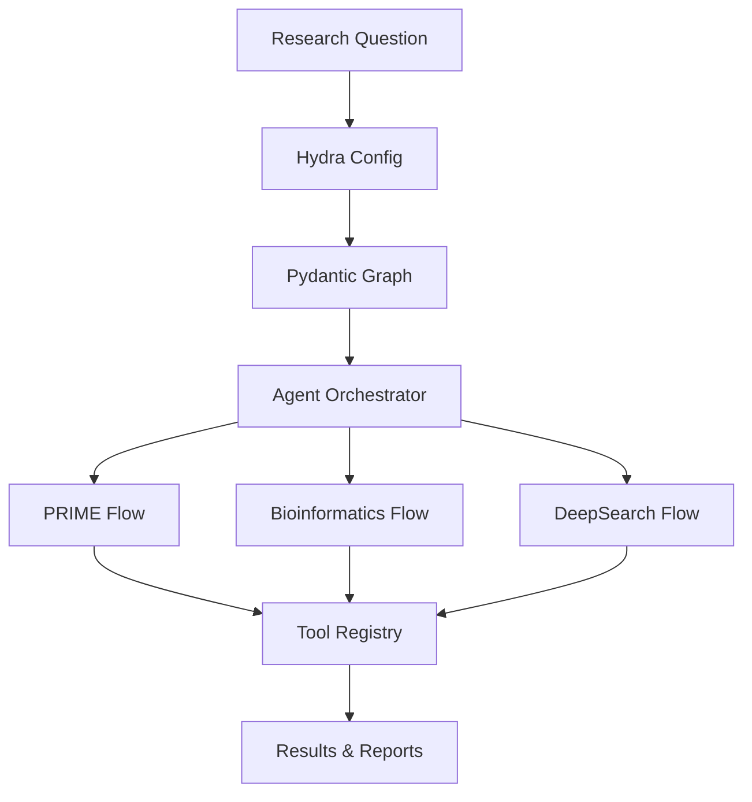

# 🚀 DeepCritical

**Hydra-configured, Pydantic Graph-based deep research workflow**

DeepCritical isn't just another research assistant—it's a framework for building entire research ecosystems. While a typical user asks one question, DeepCritical generates datasets of hypotheses, tests them systematically, runs simulations, and produces comprehensive reports—all through configurable Hydra-based workflows.

## ✨ Key Features

- **🔧 Hydra Configuration**: Flexible, composable configuration system
- **🔄 Pydantic Graph**: Stateful workflow execution with type safety
- **🤖 Multi-Agent System**: Specialized agents for different research tasks
- **🧬 PRIME Integration**: Protein engineering workflows with 65+ tools
- **🔬 Bioinformatics**: Multi-source data fusion and reasoning
- **🌐 DeepSearch**: Web research automation
- **📊 Comprehensive Tooling**: RAG, analytics, and execution environments

## 🚀 Quick Start

```bash
# Install with uv (recommended)
uv sync

# Run a simple research query
uv run deepresearch question="What is machine learning?"

# Enable PRIME flow for protein engineering
uv run deepresearch flows.prime.enabled=true question="Design a therapeutic antibody"
```

## 🏗️ Architecture Overview



## 📚 Documentation

- **[Getting Started](getting-started/installation.md)** - Installation and setup
- **[Architecture](architecture/overview.md)** - System design and components
- **[Flows](user-guide/flows/prime.md)** - Available research workflows
- **[Tools](user-guide/tools/registry.md)** - Tool ecosystem and registry
- **[API Reference](core/index.md)** - Complete API documentation
- **[Examples](examples/basic.md)** - Usage examples and tutorials

## 🤝 Contributing

We welcome contributions! Please see our [Contributing Guide](development/contributing.md) for details.

## 📄 License

This project is licensed under the MIT License - see the [LICENSE](LICENSE) file for details.

## 📊 Project Status

[](https://github.com/deepcritical/DeepCritical/actions)
[](https://pypi.org/project/deepcritical/)
[](LICENSE)
