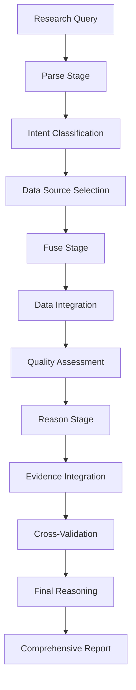

# Bioinformatics Flow

The Bioinformatics flow provides comprehensive multi-source data fusion and integrative reasoning capabilities for biological research questions.

## Overview

The Bioinformatics flow implements a sophisticated data fusion pipeline that integrates multiple biological databases and applies advanced reasoning to provide comprehensive answers to complex biological questions.

## Architecture



## Configuration

### Basic Configuration
```yaml
# Enable bioinformatics flow
flows:
  bioinformatics:
    enabled: true
    data_sources:
      go:
        enabled: true
        evidence_codes: ["IDA", "EXP"]
      pubmed:
        enabled: true
        max_results: 50
```

### Advanced Configuration
```yaml
# configs/statemachines/flows/bioinformatics.yaml
enabled: true

data_sources:
  go:
    enabled: true
    api_base_url: "https://api.geneontology.org"
    evidence_codes: ["IDA", "EXP", "TAS", "IMP"]
    year_min: 2020
    quality_threshold: 0.85
    max_annotations: 1000

  pubmed:
    enabled: true
    api_base_url: "https://eutils.ncbi.nlm.nih.gov/entrez/eutils"
    max_results: 100
    include_abstracts: true
    year_min: 2020
    relevance_threshold: 0.7

  geo:
    enabled: false
    max_datasets: 10
    sample_threshold: 50

  cmap:
    enabled: false
    max_profiles: 100
    correlation_threshold: 0.8

fusion:
  quality_threshold: 0.8
  max_entities: 1000
  cross_reference_enabled: true
  evidence_prioritization: true

reasoning:
  model: "anthropic:claude-sonnet-4-0"
  confidence_threshold: 0.75
  integrative_approach: true
  evidence_codes_priority: ["IDA", "EXP", "TAS", "IMP", "IGI"]
```

## Data Sources

### Gene Ontology (GO)
```yaml
# GO annotation retrieval
go_annotations = await go_tool.query_annotations(
    gene_id="TP53",
    evidence_codes=["IDA", "EXP"],
    year_min=2020,
    max_results=100
)

# Process annotations
for annotation in go_annotations:
    print(f"GO Term: {annotation.go_id}")
    print(f"Evidence: {annotation.evidence_code}")
    print(f"Reference: {annotation.reference}")
```

### PubMed Integration
```yaml
# Literature search and retrieval
pubmed_results = await pubmed_tool.search_and_fetch(
    query="TP53 AND cancer AND apoptosis",
    max_results=50,
    include_abstracts=True,
    year_min=2020
)

# Extract key information
for paper in pubmed_results:
    print(f"PMID: {paper.pmid}")
    print(f"Title: {paper.title}")
    print(f"Abstract: {paper.abstract[:200]}...")
```

### Expression Data (GEO)
```yaml
# Gene expression analysis
geo_datasets = await geo_tool.query_datasets(
    gene_symbol="TP53",
    conditions=["cancer", "normal"],
    sample_count_min=50
)

# Analyze differential expression
for dataset in geo_datasets:
    print(f"Dataset: {dataset.accession}")
    print(f"Expression fold change: {dataset.fold_change}")
```

### Perturbation Data (CMAP)
```yaml
# Drug perturbation analysis
cmap_profiles = await cmap_tool.query_perturbations(
    gene_targets=["TP53"],
    compounds=["doxorubicin", "cisplatin"],
    correlation_threshold=0.8
)

# Identify drug-gene relationships
for profile in cmap_profiles:
    print(f"Compound: {profile.compound}")
    print(f"Correlation: {profile.correlation}")
```

## Usage Examples

### Gene Function Analysis
```bash
uv run deepresearch \
  flows.bioinformatics.enabled=true \
  question="What is the function of TP53 gene based on GO annotations and recent literature?"
```

### Drug-Target Analysis
```bash
uv run deepresearch \
  flows.bioinformatics.enabled=true \
  question="Analyze the relationship between drug X and protein Y using expression profiles and interactions"
```

### Multi-Source Integration
```bash
uv run deepresearch \
  flows.bioinformatics.enabled=true \
  question="What is the likely function of protein P12345 based on its structure, expression, and GO annotations?"
```

## Evidence Integration

The bioinformatics flow uses sophisticated evidence integration:

### Evidence Code Prioritization
1. **IDA** (Inferred from Direct Assay) - Gold standard experimental evidence
2. **EXP** (Inferred from Experiment) - Experimental evidence
3. **TAS** (Traceable Author Statement) - Curated expert knowledge
4. **IMP** (Inferred from Mutant Phenotype) - Genetic evidence
5. **IGI** (Inferred from Genetic Interaction) - Interaction evidence

### Cross-Database Validation
- Consistency checks across GO, UniProt, and literature
- Temporal relevance validation (recent vs. outdated annotations)
- Species-specific annotation filtering
- Confidence score aggregation

## Quality Assessment

### Data Quality Metrics
```python
# Quality assessment framework
quality_metrics = {
    "annotation_quality": 0.85,  # GO annotation confidence
    "literature_relevance": 0.92,  # PubMed result relevance
    "expression_consistency": 0.78,  # GEO data consistency
    "cross_reference_agreement": 0.89  # Agreement across sources
}

# Overall quality score
overall_quality = sum(quality_metrics.values()) / len(quality_metrics)
```

### Confidence Scoring
- **High Confidence** (>0.85): Strong evidence from multiple sources
- **Medium Confidence** (0.7-0.85): Good evidence with some inconsistencies
- **Low Confidence** (<0.7): Weak or conflicting evidence

## Reasoning Integration

### Integrative Reasoning Process
```python
# Multi-source evidence synthesis
reasoning_result = await reasoning_agent.integrate_evidence(
    go_annotations=go_data,
    literature=pubmed_data,
    expression=geo_data,
    interactions=string_data,
    confidence_threshold=0.75
)

# Generate comprehensive explanation
final_answer = {
    "primary_function": reasoning_result.primary_function,
    "evidence_summary": reasoning_result.evidence_summary,
    "confidence_score": reasoning_result.confidence_score,
    "alternative_functions": reasoning_result.alternative_functions,
    "research_gaps": reasoning_result.research_gaps
}
```

## Output Formats

### Structured Results
```json
{
  "query": "TP53 gene function analysis",
  "data_sources_used": ["go", "pubmed", "geo"],
  "results": {
    "primary_function": "Tumor suppressor protein",
    "molecular_function": ["DNA binding", "Transcription regulation"],
    "biological_process": ["Cell cycle arrest", "Apoptosis"],
    "cellular_component": ["Nucleus", "Cytoplasm"],
    "evidence_strength": "high",
    "confidence_score": 0.89
  },
  "literature_summary": {
    "total_papers": 1247,
    "relevant_papers": 89,
    "key_findings": ["TP53 mutations in 50% of cancers"],
    "recent_trends": ["Immunotherapy targeting"]
  }
}
```

### Visualization Outputs
- GO term enrichment plots
- Expression heatmap visualizations
- Protein interaction networks
- Literature co-occurrence graphs

## Integration Examples

### With PRIME Flow
```bash
uv run deepresearch \
  flows.prime.enabled=true \
  flows.bioinformatics.enabled=true \
  question="Design TP53-targeted therapy based on functional annotations and interaction data"
```

### With DeepSearch Flow
```bash
uv run deepresearch \
  flows.bioinformatics.enabled=true \
  flows.deepsearch.enabled=true \
  question="Latest research on TP53 mutations and their therapeutic implications"
```

## Advanced Features

### Custom Data Sources
```python
# Add custom data source
custom_source = {
    "name": "my_database",
    "type": "protein_interactions",
    "api_endpoint": "https://my-api.com",
    "authentication": {"token": "my-token"}
}

# Register for use
config_manager.add_data_source(custom_source)
```

### Evidence Weighting
```python
# Customize evidence weighting
evidence_weights = {
    "IDA": 1.0,    # Direct experimental evidence
    "EXP": 0.9,    # Experimental evidence
    "TAS": 0.8,    # Curated expert knowledge
    "IMP": 0.7,    # Genetic evidence
    "IGI": 0.6     # Interaction evidence
}

# Apply to reasoning
reasoning_config.evidence_weights = evidence_weights
```

## Best Practices

1. **Multi-Source Validation**: Always use multiple data sources for validation
2. **Evidence Prioritization**: Focus on high-quality, recent evidence
3. **Cross-Reference Checking**: Validate findings across different databases
4. **Temporal Filtering**: Consider recency of annotations and literature
5. **Species Consideration**: Account for species-specific differences

## Troubleshooting

### Common Issues

**Low-Quality Results:**
```bash
# Increase quality thresholds
flows.bioinformatics.fusion.quality_threshold=0.85
flows.bioinformatics.data_sources.go.quality_threshold=0.9
```

**Slow Data Retrieval:**
```bash
# Optimize data source settings
flows.bioinformatics.data_sources.pubmed.max_results=50
flows.bioinformatics.data_sources.go.max_annotations=500
```

**Integration Failures:**
```bash
# Enable cross-reference validation
flows.bioinformatics.fusion.cross_reference_enabled=true
flows.bioinformatics.reasoning.integrative_approach=true
```

For more detailed information, see the [Bioinformatics Integration Guide](../development/bioinformatics-integration.md) and [Data Types API Reference](../api/datatypes.md).
