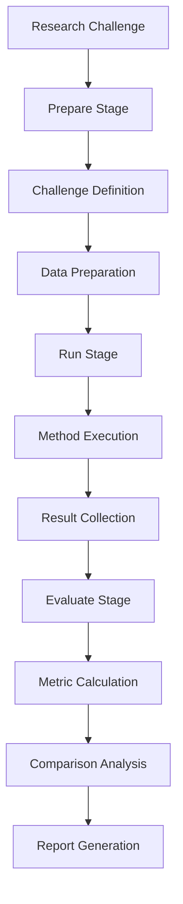

# Challenge Flow

The Challenge flow provides experimental workflows for research challenges, benchmarks, and systematic evaluation of research questions.

## Overview

The Challenge flow implements structured experimental frameworks for testing hypotheses, benchmarking methods, and conducting systematic research evaluations.

## Architecture



## Configuration

### Basic Configuration
```yaml
# Enable challenge flow
flows:
  challenge:
    enabled: true
```

### Advanced Configuration
```yaml
# configs/statemachines/flows/challenge.yaml
enabled: true

challenge:
  type: "benchmark"  # benchmark, hypothesis_test, method_comparison
  domain: "machine_learning"  # ml, bioinformatics, chemistry, etc.

  preparation:
    data_splitting:
      method: "stratified_kfold"
      n_splits: 5
      random_state: 42

    preprocessing:
      standardization: true
      feature_selection: true
      outlier_removal: true

  execution:
    methods: ["method1", "method2", "baseline"]
    repetitions: 10
    parallel_execution: true
    timeout_per_run: 3600

  evaluation:
    metrics: ["accuracy", "precision", "recall", "f1_score", "auc_roc"]
    statistical_tests: ["t_test", "wilcoxon", "friedman"]
    significance_level: 0.05

    comparison:
      pairwise_comparison: true
      ranking_method: "nemenyi"
      effect_size_calculation: true

  reporting:
    formats: ["latex", "html", "jupyter"]
    include_raw_results: true
    generate_plots: true
    statistical_summary: true
```

## Challenge Types

### Benchmark Challenges
```python
# Standard benchmark evaluation
benchmark = ChallengeFlow.create_benchmark(
    dataset="iris",
    methods=["svm", "random_forest", "neural_network"],
    metrics=["accuracy", "f1_score"],
    cv_folds=5
)

# Execute benchmark
results = await benchmark.execute()
print(f"Best method: {results.best_method}")
print(f"Statistical significance: {results.significance}")
```

### Hypothesis Testing
```python
# Hypothesis testing framework
hypothesis_test = ChallengeFlow.create_hypothesis_test(
    hypothesis="New method outperforms baseline",
    null_hypothesis="No performance difference",
    methods=["new_method", "baseline"],
    statistical_test="paired_ttest",
    significance_level=0.05
)

# Run hypothesis test
test_results = await hypothesis_test.execute()
print(f"P-value: {test_results.p_value}")
print(f"Reject null: {test_results.reject_null}")
```

### Method Comparison
```python
# Comprehensive method comparison
comparison = ChallengeFlow.create_method_comparison(
    methods=["method_a", "method_b", "method_c"],
    datasets=["dataset1", "dataset2", "dataset3"],
    evaluation_metrics=["accuracy", "efficiency", "robustness"],
    statistical_analysis=True
)

# Execute comparison
comparison_results = await comparison.execute()
print(f"Rankings: {comparison_results.rankings}")
```

## Usage Examples

### Machine Learning Benchmark
```bash
uv run deepresearch \
  flows.challenge.enabled=true \
  question="Benchmark different ML algorithms on classification tasks"
```

### Algorithm Comparison
```bash
uv run deepresearch \
  flows.challenge.enabled=true \
  question="Compare optimization algorithms for neural network training"
```

### Method Validation
```bash
uv run deepresearch \
  flows.challenge.enabled=true \
  question="Validate new feature selection method against established baselines"
```

## Experimental Design

### Data Preparation
```python
# Systematic data preparation
data_prep = {
    "dataset_splitting": {
        "method": "stratified_kfold",
        "n_splits": 5,
        "shuffle": True,
        "random_state": 42
    },
    "feature_preprocessing": {
        "standardization": True,
        "normalization": True,
        "feature_selection": {
            "method": "mutual_information",
            "k_features": 50
        }
    },
    "quality_control": {
        "outlier_detection": True,
        "missing_value_imputation": True,
        "data_validation": True
    }
}
```

### Method Configuration
```python
# Method parameter grids
method_configs = {
    "random_forest": {
        "n_estimators": [10, 50, 100, 200],
        "max_depth": [None, 10, 20, 30],
        "min_samples_split": [2, 5, 10]
    },
    "svm": {
        "C": [0.1, 1, 10, 100],
        "kernel": ["linear", "rbf", "poly"],
        "gamma": ["scale", "auto"]
    },
    "neural_network": {
        "hidden_layers": [[50], [100, 50], [200, 100, 50]],
        "learning_rate": [0.001, 0.01, 0.1],
        "batch_size": [32, 64, 128]
    }
}
```

## Statistical Analysis

### Performance Metrics
```python
# Comprehensive metric calculation
metrics = {
    "classification": ["accuracy", "precision", "recall", "f1_score", "auc_roc"],
    "regression": ["mae", "mse", "rmse", "r2_score"],
    "ranking": ["ndcg", "map", "precision_at_k"],
    "clustering": ["silhouette_score", "calinski_harabasz_score"]
}

# Calculate all metrics
results = calculate_metrics(predictions, true_labels, metrics)
```

### Statistical Testing
```python
# Statistical significance testing
statistical_tests = {
    "parametric": ["t_test", "paired_ttest", "anova"],
    "nonparametric": ["wilcoxon", "mannwhitneyu", "kruskal"],
    "posthoc": ["tukey", "bonferroni", "holm"]
}

# Perform statistical analysis
stats_results = perform_statistical_tests(
    method_results,
    tests=statistical_tests,
    alpha=0.05
)
```

## Visualization and Reporting

### Performance Plots
```python
# Generate comprehensive plots
plots = {
    "box_plots": create_box_plots(method_results),
    "line_plots": create_learning_curves(training_history),
    "heatmap": create_confusion_matrix_heatmap(confusion_matrix),
    "bar_charts": create_metric_comparison_bar_chart(metrics),
    "scatter_plots": create_method_ranking_scatter(ranking_results)
}

# Save visualizations
for plot_name, plot in plots.items():
    plot.savefig(f"{plot_name}.png", dpi=300, bbox_inches='tight')
```

### Statistical Reports
```markdown
# Statistical Analysis Report

## Method Performance Summary

| Method | Accuracy | Precision | Recall | F1-Score |
|--------|----------|-----------|--------|----------|
| Method A | 0.89 ± 0.03 | 0.87 ± 0.04 | 0.91 ± 0.02 | 0.89 ± 0.03 |
| Method B | 0.85 ± 0.04 | 0.83 ± 0.05 | 0.88 ± 0.03 | 0.85 ± 0.04 |
| Baseline | 0.78 ± 0.05 | 0.76 ± 0.06 | 0.81 ± 0.04 | 0.78 ± 0.05 |

## Statistical Significance

### Pairwise Comparisons (p-values)
- Method A vs Method B: p = 0.023 (significant)
- Method A vs Baseline: p < 0.001 (highly significant)
- Method B vs Baseline: p = 0.089 (not significant)

### Effect Sizes (Cohen's d)
- Method A vs Baseline: d = 1.23 (large effect)
- Method B vs Baseline: d = 0.45 (medium effect)
```

## Integration Examples

### With PRIME Flow
```bash
uv run deepresearch \
  flows.prime.enabled=true \
  flows.challenge.enabled=true \
  question="Benchmark different protein design algorithms on standard test sets"
```

### With Bioinformatics Flow
```bash
uv run deepresearch \
  flows.bioinformatics.enabled=true \
  flows.challenge.enabled=true \
  question="Evaluate gene function prediction methods using GO annotation benchmarks"
```

## Advanced Features

### Custom Evaluation Metrics
```python
# Define custom evaluation function
def custom_metric(predictions, targets):
    """Custom evaluation metric for specific domain."""
    # Implementation here
    return custom_score

# Register custom metric
challenge_config.evaluation.metrics.append({
    "name": "custom_metric",
    "function": custom_metric,
    "higher_is_better": True
})
```

### Adaptive Experimentation
```python
# Adaptive experimental design
adaptive_experiment = {
    "initial_methods": ["baseline", "method_a"],
    "evaluation_metric": "accuracy",
    "improvement_threshold": 0.02,
    "max_iterations": 10,
    "method_selection": "tournament"
}

# Run adaptive experiment
results = await run_adaptive_experiment(adaptive_experiment)
```

## Best Practices

1. **Clear Hypotheses**: Define clear, testable hypotheses
2. **Appropriate Metrics**: Choose metrics relevant to your domain
3. **Statistical Rigor**: Use proper statistical testing and significance levels
4. **Reproducible Setup**: Ensure experiments can be reproduced
5. **Comprehensive Reporting**: Include statistical analysis and visualizations

## Troubleshooting

### Common Issues

**Statistical Test Failures:**
```bash
# Check data normality and use appropriate tests
flows.challenge.evaluation.statistical_tests=["wilcoxon"]
flows.challenge.evaluation.significance_level=0.05
```

**Performance Variability:**
```bash
# Increase repetitions for stable results
flows.challenge.execution.repetitions=20
flows.challenge.execution.random_state=42
```

**Memory Issues:**
```bash
# Reduce dataset size or use sampling
flows.challenge.preparation.data_splitting.sample_fraction=0.5
flows.challenge.execution.parallel_execution=false
```

For more detailed information, see the [Experimental Design Guide](../development/experimental-design.md) and [Statistical Analysis Documentation](../user-guide/tools/statistical-analysis.md).
