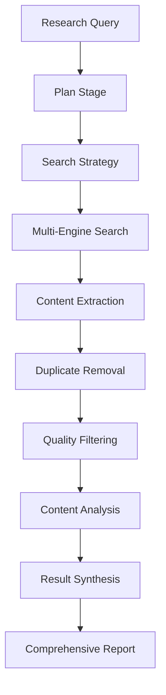

# DeepSearch Flow

The DeepSearch flow provides comprehensive web research automation capabilities, integrating multiple search engines and advanced content processing for thorough information gathering.

## Overview

DeepSearch implements an intelligent web research pipeline that combines multiple search engines, content extraction, duplicate removal, and quality filtering to provide comprehensive and reliable research results.

## Architecture



## Configuration

### Basic Configuration
```yaml
# Enable DeepSearch flow
flows:
  deepsearch:
    enabled: true
```

### Advanced Configuration
```yaml
# configs/statemachines/flows/deepsearch.yaml
enabled: true

search_engines:
  - name: "google"
    enabled: true
    max_results: 20
    api_key: "${oc.env:GOOGLE_API_KEY}"
    search_type: "web"

  - name: "duckduckgo"
    enabled: true
    max_results: 15
    safe_search: true

  - name: "bing"
    enabled: false
    max_results: 20
    api_key: "${oc.env:BING_API_KEY}"

processing:
  extract_content: true
  remove_duplicates: true
  quality_filtering: true
  min_content_length: 500
  max_content_length: 50000

  content_processing:
    extract_metadata: true
    detect_language: true
    sentiment_analysis: false
    keyword_extraction: true

analysis:
  model: "anthropic:claude-sonnet-4-0"
  summarize_results: true
  identify_gaps: true
  suggest_follow_up: true

output:
  include_raw_results: false
  include_processed_content: true
  generate_summary: true
  export_format: ["markdown", "json"]
```

## Search Engines

### Google Search
```python
# Google Custom Search integration
google_results = await google_tool.search(
    query="machine learning applications",
    num_results=20,
    site_search=None,
    date_restrict=None,
    language="en"
)

# Process results
for result in google_results:
    print(f"Title: {result.title}")
    print(f"URL: {result.url}")
    print(f"Snippet: {result.snippet}")
```

### DuckDuckGo Search
```python
# Privacy-focused search
ddg_results = await ddg_tool.search(
    query="quantum computing research",
    region="us-en",
    safesearch="moderate",
    timelimit="y"
)

# Extract instant answers
if ddg_results.instant_answer:
    print(f"Instant Answer: {ddg_results.instant_answer}")
```

### Bing Search
```python
# Microsoft Bing integration
bing_results = await bing_tool.search(
    query="artificial intelligence ethics",
    count=20,
    offset=0,
    market="en-US",
    freshness="month"
)

# Access rich snippets
for result in bing_results:
    if result.rich_snippet:
        print(f"Rich data: {result.rich_snippet}")
```

## Content Processing

### Content Extraction
```python
# Extract full content from URLs
extracted_content = await extractor_tool.extract(
    urls=["https://example.com/article"],
    include_metadata=True,
    remove_boilerplate=True,
    extract_tables=True
)

# Process extracted content
for content in extracted_content:
    print(f"Title: {content.title}")
    print(f"Text length: {len(content.text)}")
    print(f"Language: {content.language}")
```

### Duplicate Detection
```python
# Remove duplicate content
unique_content = await dedup_tool.remove_duplicates(
    content_list=extracted_content,
    similarity_threshold=0.85,
    method="semantic"
)

print(f"Original: {len(extracted_content)}")
print(f"Unique: {len(unique_content)}")
```

### Quality Filtering
```python
# Filter low-quality content
quality_content = await quality_tool.filter(
    content_list=unique_content,
    min_length=500,
    max_length=50000,
    min_readability_score=30,
    require_images=False,
    check_freshness=True,
    max_age_days=365
)

print(f"Quality content: {len(quality_content)}")
```

## Usage Examples

### Academic Research
```bash
uv run deepresearch \
  flows.deepsearch.enabled=true \
  question="Latest advances in CRISPR gene editing 2024"
```

### Market Research
```bash
uv run deepsearch \
  flows.deepsearch.enabled=true \
  question="Current trends in artificial intelligence market 2024"
```

### Technical Documentation
```bash
uv run deepsearch \
  flows.deepsearch.enabled=true \
  question="Python async programming best practices"
```

## Advanced Features

### Custom Search Strategies
```python
# Multi-stage search strategy
strategy = {
    "initial_search": {
        "engines": ["google", "duckduckgo"],
        "query_variants": ["machine learning", "ML applications", "AI techniques"]
    },
    "follow_up_search": {
        "engines": ["google"],
        "query_expansion": true,
        "related_terms": ["deep learning", "neural networks", "computer vision"]
    },
    "deep_dive": {
        "engines": ["bing"],
        "academic_sources": true,
        "recent_publications": true
    }
}
```

### Content Analysis
```python
# Advanced content analysis
analysis = await analyzer_tool.analyze(
    content_list=quality_content,
    analysis_types=["sentiment", "topics", "entities", "summary"],
    model="anthropic:claude-sonnet-4-0"
)

# Extract insights
insights = {
    "main_topics": analysis.topics,
    "sentiment_distribution": analysis.sentiment,
    "key_entities": analysis.entities,
    "content_summary": analysis.summary
}
```

### Gap Analysis
```python
# Identify research gaps
gaps = await gap_analyzer.identify_gaps(
    query="machine learning applications",
    search_results=quality_content,
    existing_knowledge=domain_knowledge
)

# Suggest research directions
for gap in gaps:
    print(f"Gap: {gap.description}")
    print(f"Importance: {gap.importance}")
    print(f"Suggested approach: {gap.suggested_approach}")
```

## Output Formats

### Structured Results
```json
{
  "query": "machine learning applications",
  "search_summary": {
    "total_results": 147,
    "unique_sources": 89,
    "quality_content": 67,
    "search_engines_used": ["google", "duckduckgo"]
  },
  "content_analysis": {
    "main_topics": ["supervised learning", "deep learning", "computer vision"],
    "sentiment": {"positive": 0.7, "neutral": 0.25, "negative": 0.05},
    "key_entities": ["neural networks", "tensorflow", "pytorch"],
    "content_summary": "Machine learning applications span computer vision, NLP, and autonomous systems..."
  },
  "research_gaps": [
    {"gap": "Edge computing ML applications", "importance": "high"},
    {"gap": "Quantum ML integration", "importance": "medium"}
  ]
}
```

### Report Generation
```markdown
# Machine Learning Applications Report

## Executive Summary
Machine learning applications have expanded significantly across multiple domains...

## Key Findings
### Computer Vision
- Object detection and recognition
- Medical image analysis
- Autonomous vehicle perception

### Natural Language Processing
- Sentiment analysis improvements
- Multilingual translation advances
- Conversational AI development

## Research Gaps
1. **Edge Computing Integration** - Limited research on ML deployment in resource-constrained environments
2. **Quantum ML Applications** - Early-stage research with high potential impact

## Recommendations
- Explore edge ML deployment strategies
- Monitor quantum ML developments closely
- Invest in multimodal learning approaches
```

## Integration Examples

### With PRIME Flow
```bash
uv run deepresearch \
  flows.prime.enabled=true \
  flows.deepsearch.enabled=true \
  question="Latest protein design techniques combined with web research"
```

### With Bioinformatics Flow
```bash
uv run deepresearch \
  flows.bioinformatics.enabled=true \
  flows.deepsearch.enabled=true \
  question="Current research on TP53 mutations from multiple sources"
```

## Best Practices

1. **Query Optimization**: Use specific, well-formed queries for better results
2. **Source Diversification**: Use multiple search engines for comprehensive coverage
3. **Content Quality**: Enable quality filtering to avoid low-value content
4. **Gap Analysis**: Use gap identification to find research opportunities
5. **Result Validation**: Cross-validate findings across multiple sources

## Troubleshooting

### Common Issues

**Poor Search Results:**
```bash
# Improve search strategy
flows.deepsearch.search_engines=[{"name": "google", "enabled": true, "max_results": 30}]
flows.deepsearch.processing.quality_filtering=true
```

**Slow Processing:**
```bash
# Optimize processing settings
flows.deepsearch.processing.min_content_length=300
flows.deepsearch.processing.max_content_length=10000
flows.deepsearch.search_engines=[{"name": "google", "max_results": 15}]
```

**Content Quality Issues:**
```bash
# Enhance quality filtering
flows.deepsearch.processing.quality_filtering=true
flows.deepsearch.processing.min_content_length=500
flows.deepsearch.processing.check_freshness=true
flows.deepsearch.processing.max_age_days=180
```

For more detailed information, see the [Search Integration Guide](../development/search-integration.md) and [Content Processing Documentation](../user-guide/tools/content-processing.md).
