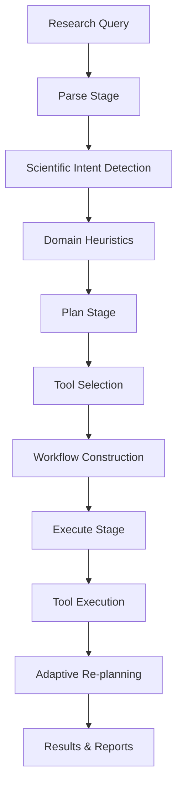

# PRIME Flow

The PRIME (Protein Research and Innovation in Molecular Engineering) flow provides comprehensive protein engineering capabilities with 65+ specialized tools across six categories.

## Overview

The PRIME flow implements the three-stage architecture described in the PRIME paper:
1. **Parse** - Query analysis and scientific intent detection
2. **Plan** - Workflow construction and tool selection
3. **Execute** - Tool execution with adaptive re-planning

## Architecture



## Configuration

### Basic Configuration
```yaml
# Enable PRIME flow
flows:
  prime:
    enabled: true
    params:
      adaptive_replanning: true
      manual_confirmation: false
      tool_validation: true
```

### Advanced Configuration
```yaml
# configs/statemachines/flows/prime.yaml
enabled: true
params:
  adaptive_replanning: true
  manual_confirmation: false
  tool_validation: true
  scientific_intent_detection: true

  domain_heuristics:
    - immunology
    - enzymology
    - cell_biology

  tool_categories:
    - knowledge_query
    - sequence_analysis
    - structure_prediction
    - molecular_docking
    - de_novo_design
    - function_prediction

  execution:
    max_iterations: 10
    convergence_threshold: 0.95
    timeout_per_step: 300
```

## Usage Examples

### Basic Protein Design
```bash
uv run deepresearch \
  flows.prime.enabled=true \
  question="Design a therapeutic antibody for SARS-CoV-2 spike protein"
```

### Protein Structure Analysis
```bash
uv run deepresearch \
  flows.prime.enabled=true \
  question="Analyze the structure of protein P12345 and predict its function"
```

### Multi-Domain Research
```bash
uv run deepresearch \
  flows.prime.enabled=true \
  question="Design an enzyme with improved thermostability for industrial applications"
```

## Tool Categories

### 1. Knowledge Query Tools
Tools for retrieving biological knowledge and literature:

- **UniProt Query**: Retrieve protein information and annotations
- **PDB Query**: Access protein structure data
- **PubMed Search**: Find relevant research literature
- **GO Annotation**: Retrieve Gene Ontology terms and annotations

### 2. Sequence Analysis Tools
Tools for analyzing protein sequences:

- **BLAST Search**: Sequence similarity search
- **Multiple Sequence Alignment**: Align related sequences
- **Motif Discovery**: Identify functional motifs
- **Physicochemical Analysis**: Calculate sequence properties

### 3. Structure Prediction Tools
Tools for predicting protein structures:

- **AlphaFold2**: AI-powered structure prediction
- **ESMFold**: Evolutionary scale modeling
- **RoseTTAFold**: Deep learning structure prediction
- **Homology Modeling**: Template-based structure prediction

### 4. Molecular Docking Tools
Tools for analyzing protein-ligand interactions:

- **AutoDock Vina**: Molecular docking simulations
- **GNINA**: Deep learning docking
- **Interaction Analysis**: Binding site identification
- **Affinity Prediction**: Binding energy calculations

### 5. De Novo Design Tools
Tools for designing novel proteins:

- **ProteinMPNN**: Sequence design from structure
- **RFdiffusion**: Structure generation
- **Ligand Design**: Small molecule design
- **Scaffold Design**: Protein scaffold engineering

### 6. Function Prediction Tools
Tools for predicting protein functions:

- **EC Number Prediction**: Enzyme classification
- **GO Term Prediction**: Function annotation
- **Binding Site Prediction**: Interaction site identification
- **Stability Prediction**: Thermal and pH stability analysis

## Scientific Intent Detection

PRIME automatically detects the scientific intent of queries:

```python
# Example classifications
intent_detection = {
    "protein_design": "Design new proteins with specific properties",
    "binding_analysis": "Analyze protein-ligand interactions",
    "structure_prediction": "Predict protein tertiary structure",
    "function_annotation": "Annotate protein functions",
    "stability_engineering": "Improve protein stability",
    "catalytic_optimization": "Optimize enzyme catalytic properties"
}
```

## Domain Heuristics

PRIME uses domain-specific heuristics for different biological areas:

### Immunology
- Antibody design and optimization
- Immune response modeling
- Epitope prediction and analysis
- Vaccine development workflows

### Enzymology
- Enzyme kinetics and mechanism analysis
- Substrate specificity engineering
- Catalytic efficiency optimization
- Industrial enzyme design

### Cell Biology
- Protein localization prediction
- Interaction network analysis
- Cellular pathway modeling
- Organelle targeting

## Adaptive Re-planning

PRIME implements sophisticated re-planning strategies:

### Strategic Re-planning
- Tool substitution when tools fail or underperform
- Algorithm switching (BLAST → ProTrek, AlphaFold2 → ESMFold)
- Resource reallocation based on intermediate results

### Tactical Re-planning
- Parameter adjustment for better results
- E-value relaxation for broader searches
- Exhaustiveness tuning for docking simulations

## Execution Monitoring

PRIME tracks execution across multiple dimensions:

### Quality Metrics
- **pLDDT Scores**: Structure prediction confidence
- **E-values**: Sequence similarity significance
- **RMSD Values**: Structure alignment quality
- **Binding Energies**: Interaction strength validation

### Performance Metrics
- **Execution Time**: Per-step and total workflow timing
- **Resource Usage**: CPU, memory, and storage utilization
- **Tool Success Rates**: Individual tool performance tracking
- **Convergence Analysis**: Workflow convergence patterns

## Output Formats

PRIME generates multiple output formats:

### Structured Reports
```json
{
  "workflow_id": "prime_20241207_143022",
  "query": "Design therapeutic antibody",
  "scientific_domain": "immunology",
  "intent": "protein_design",
  "results": {
    "structures": [...],
    "sequences": [...],
    "analyses": [...]
  },
  "execution_summary": {
    "total_time": 2847.2,
    "tools_used": 12,
    "success_rate": 0.92
  }
}
```

### Visualization Outputs
- Protein structure visualizations (PyMOL, NGL View)
- Sequence alignment diagrams
- Interaction network graphs
- Performance metric charts

### Publication-Ready Reports
- LaTeX-formatted academic papers
- Jupyter notebooks with interactive analysis
- HTML reports with embedded visualizations

## Integration Examples

### With Bioinformatics Flow
```bash
uv run deepresearch \
  flows.prime.enabled=true \
  flows.bioinformatics.enabled=true \
  question="Analyze TP53 mutations and design targeted therapies"
```

### With DeepSearch Flow
```bash
uv run deepresearch \
  flows.prime.enabled=true \
  flows.deepsearch.enabled=true \
  question="Latest advances in protein design combined with structural analysis"
```

## Best Practices

1. **Start Specific**: Begin with well-defined protein engineering questions
2. **Use Domain Heuristics**: Leverage appropriate domain knowledge
3. **Monitor Quality Metrics**: Pay attention to confidence scores and validation metrics
4. **Iterative Refinement**: Use intermediate results to guide subsequent steps
5. **Tool Validation**: Ensure tool outputs meet quality thresholds before proceeding

## Troubleshooting

### Common Issues

**Low Quality Predictions:**
```bash
# Increase tool validation thresholds
flows.prime.params.tool_validation=true
flows.prime.params.quality_threshold=0.8
```

**Slow Execution:**
```bash
# Enable faster variants
flows.prime.params.use_fast_variants=true
flows.prime.params.max_parallel_tools=5
```

**Tool Failures:**
```bash
# Enable fallback tools
flows.prime.params.enable_tool_fallbacks=true
flows.prime.params.retry_failed_tools=true
```

For more detailed information, see the [PRIME Implementation Guide](../development/prime-implementation.md) and [Tool Registry Documentation](../user-guide/tools/tool-registry.md).
