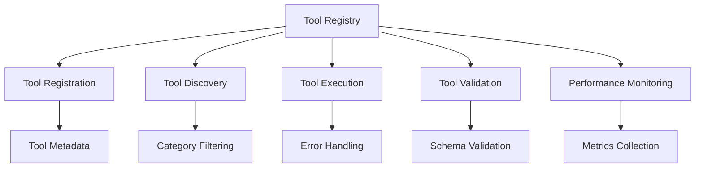

# Tool Registry

The Tool Registry provides centralized management and execution of all DeepCritical tools, enabling dynamic tool discovery, registration, and coordinated execution.

## Overview

The Tool Registry serves as the central hub for tool management in DeepCritical, providing:

- **Tool Registration**: Dynamic registration of tools with metadata
- **Tool Discovery**: Runtime discovery and filtering of available tools
- **Tool Execution**: Coordinated execution with error handling and retry logic
- **Tool Validation**: Input/output validation and type checking
- **Performance Monitoring**: Execution metrics and performance tracking

## Architecture



## Core Components

### Tool Registry
```python
from deepresearch.src.utils.tool_registry import ToolRegistry

# Get global registry instance
registry = ToolRegistry.get_instance()

# Register a new tool
registry.register_tool(tool_spec, tool_runner)

# Execute a tool
result = registry.execute_tool("tool_name", parameters)
```

### Tool Specification
```python
from deepresearch.src.utils.tool_registry import ToolSpec, ToolCategory

# Define tool specification
tool_spec = ToolSpec(
    name="my_analysis_tool",
    description="Performs advanced data analysis",
    category=ToolCategory.ANALYTICS,
    inputs={
        "data": "dict",
        "analysis_type": "str",
        "parameters": "dict"
    },
    outputs={
        "result": "dict",
        "statistics": "dict",
        "metadata": "dict"
    },
    metadata={
        "version": "1.0.0",
        "author": "Research Team",
        "dependencies": ["numpy", "pandas"]
    }
)
```

## Tool Categories

DeepCritical organizes tools into logical categories:

### Knowledge Query Tools
- **UniProt Query**: Protein information retrieval
- **PDB Query**: Structure data access
- **PubMed Search**: Literature search and retrieval
- **GO Annotation**: Gene ontology annotations

### Sequence Analysis Tools
- **BLAST Search**: Sequence similarity analysis
- **Multiple Alignment**: Sequence alignment tools
- **Motif Discovery**: Functional motif identification
- **Physicochemical Analysis**: Sequence property calculation

### Structure Prediction Tools
- **AlphaFold2**: AI-powered structure prediction
- **ESMFold**: Evolutionary scale modeling
- **Homology Modeling**: Template-based prediction
- **Structure Validation**: Quality assessment tools

### Analytics Tools
- **Statistical Analysis**: Hypothesis testing and statistical modeling
- **Data Visualization**: Plotting and chart generation
- **Machine Learning**: Classification and regression tools
- **Quality Assessment**: Data quality evaluation

## Usage Examples

### Basic Tool Registration
```python
from deepresearch.tools import ToolRunner, ToolSpec, ToolCategory

class MyCustomTool(ToolRunner):
    """Custom tool for specific analysis."""

    def __init__(self):
        super().__init__(ToolSpec(
            name="custom_analysis",
            description="Performs custom data analysis",
            category=ToolCategory.ANALYTICS,
            inputs={
                "data": "dict",
                "method": "str",
                "parameters": "dict"
            },
            outputs={
                "result": "dict",
                "statistics": "dict"
            }
        ))

    def run(self, parameters: Dict[str, Any]) -> ExecutionResult:
        """Execute the analysis."""
        # Implementation here
        return ExecutionResult(success=True, data={"result": "analysis"})

# Register the tool
registry = ToolRegistry.get_instance()
registry.register_tool(
    tool_spec=MyCustomTool().get_spec(),
    tool_runner=MyCustomTool()
)
```

### Tool Discovery and Filtering
```python
# List all available tools
all_tools = registry.list_tools()
print(f"Available tools: {list(all_tools.keys())}")

# Get tools by category
analytics_tools = registry.get_tools_by_category(ToolCategory.ANALYTICS)
search_tools = registry.get_tools_by_category(ToolCategory.SEARCH)

# Search tools by name pattern
blast_tools = registry.search_tools("blast")
analysis_tools = registry.search_tools("analysis")

# Get tool specification
tool_spec = registry.get_tool_spec("web_search")
print(f"Tool inputs: {tool_spec.inputs}")
print(f"Tool outputs: {tool_spec.outputs}")
```

### Tool Execution
```python
# Execute a tool with parameters
result = registry.execute_tool("web_search", {
    "query": "machine learning applications",
    "num_results": 10,
    "include_snippets": True
})

if result.success:
    print(f"Results: {result.data}")
    print(f"Execution time: {result.execution_time}")
else:
    print(f"Error: {result.error}")
    print(f"Error type: {result.error_type}")
```

### Batch Tool Execution
```python
# Execute multiple tools in sequence
tool_sequence = [
    ("web_search", {"query": "machine learning", "num_results": 5}),
    ("content_analysis", {"content": "search_results", "analysis_type": "sentiment"}),
    ("summarize", {"content": "analysis_results", "max_length": 500})
]

results = registry.execute_tool_sequence(tool_sequence)

for i, result in enumerate(results):
    print(f"Step {i+1}: {'Success' if result.success else 'Failed'}")
    if result.success:
        print(f"  Output: {result.data}")
```

## Advanced Features

### Tool Dependencies
```python
# Define tool with dependencies
dependent_tool_spec = ToolSpec(
    name="complex_analysis",
    description="Multi-step analysis requiring other tools",
    dependencies=["web_search", "data_processing"],
    inputs={"query": "str"},
    outputs={"comprehensive_result": "dict"}
)

# Registry handles dependency resolution
result = registry.execute_tool("complex_analysis", {"query": "test"})
```

### Tool Validation
```python
# Validate tool inputs and outputs
try:
    validated_inputs = registry.validate_tool_inputs("tool_name", parameters)
    validated_outputs = registry.validate_tool_outputs("tool_name", result_data)
    print("Tool validation passed")
except ValidationError as e:
    print(f"Validation failed: {e}")
```

### Performance Monitoring
```python
# Get tool performance metrics
metrics = registry.get_tool_metrics("web_search")
print(f"Average execution time: {metrics.avg_execution_time}")
print(f"Success rate: {metrics.success_rate}")
print(f"Total executions: {metrics.total_executions}")

# Get performance trends
trends = registry.get_performance_trends("web_search", days=7)
print(f"Performance trend: {trends}")
```

### Error Handling and Retry
```python
# Configure retry behavior
registry.configure_tool_retries(
    tool_name="unreliable_tool",
    max_retries=3,
    retry_delay=1.0,
    backoff_factor=2.0
)

# Execute with automatic retry
result = registry.execute_tool("unreliable_tool", parameters)
```

## Configuration

### Registry Configuration
```yaml
# configs/tool_registry.yaml
tool_registry:
  auto_discovery: true
  cache_enabled: true
  cache_ttl: 3600
  max_concurrent_executions: 10
  retry_failed_tools: true
  retry_attempts: 3
  validation_enabled: true

  performance_monitoring:
    enabled: true
    metrics_retention_days: 30
    alert_thresholds:
      avg_execution_time: 60  # seconds
      error_rate: 0.1         # 10%
      success_rate: 0.9       # 90%
```

### Tool-Specific Configuration
```yaml
# Individual tool configurations
tool_configs:
  web_search:
    max_results: 20
    timeout: 30
    retry_on_failure: true

  bioinformatics_tools:
    blast:
      e_value_threshold: 1e-5
      max_target_seqs: 100

    structure_prediction:
      alphafold:
        max_model_len: 2000
        use_gpu: true
```

## Tool Development

### Creating Custom Tools
```python
from deepresearch.tools import ToolRunner, ToolSpec, ToolCategory
from deepresearch.datatypes import ExecutionResult

class CustomBioinformaticsTool(ToolRunner):
    """Custom tool for bioinformatics analysis."""

    def __init__(self):
        super().__init__(ToolSpec(
            name="custom_go_analysis",
            description="Advanced GO term enrichment analysis",
            category=ToolCategory.BIOINFORMATICS,
            inputs={
                "gene_list": "list",
                "background_genes": "list",
                "organism": "str",
                "p_value_threshold": "float"
            },
            outputs={
                "enriched_terms": "list",
                "statistics": "dict",
                "visualization_data": "dict"
            }
        ))

    def run(self, parameters: Dict[str, Any]) -> ExecutionResult:
        """Execute GO enrichment analysis."""
        try:
            # Extract parameters
            gene_list = parameters["gene_list"]
            background = parameters.get("background_genes", [])
            organism = parameters["organism"]
            p_threshold = parameters["p_value_threshold"]

            # Perform analysis
            enriched_terms = self._perform_go_analysis(
                gene_list, background, organism, p_threshold
            )

            # Generate visualization data
            viz_data = self._generate_visualization(enriched_terms)

            return ExecutionResult(
                success=True,
                data={
                    "enriched_terms": enriched_terms,
                    "statistics": self._calculate_statistics(enriched_terms),
                    "visualization_data": viz_data
                }
            )

        except Exception as e:
            return ExecutionResult(
                success=False,
                error=str(e),
                error_type=type(e).__name__
            )

    def _perform_go_analysis(self, genes, background, organism, p_threshold):
        """Perform the actual GO analysis."""
        # Implementation here
        return []

    def _calculate_statistics(self, enriched_terms):
        """Calculate enrichment statistics."""
        # Implementation here
        return {}

    def _generate_visualization(self, enriched_terms):
        """Generate visualization data."""
        # Implementation here
        return {}
```

### Tool Testing
```python
# Test tool functionality
test_result = registry.test_tool("custom_go_analysis", {
    "gene_list": ["TP53", "BRCA1", "EGFR"],
    "organism": "human",
    "p_value_threshold": 0.05
})

if test_result.success:
    print("Tool test passed")
    print(f"Test output: {test_result.data}")
else:
    print(f"Tool test failed: {test_result.error}")
```

## Integration

### With Agent System
```python
# Tools automatically available to agents
@agent.tool
def use_registered_tool(ctx, tool_name: str, parameters: dict) -> str:
    """Use any registered tool through the agent."""
    result = registry.execute_tool(tool_name, parameters)
    return str(result.data) if result.success else f"Error: {result.error}"
```

### With Workflow System
```python
# Tools integrated into workflow nodes
class ToolExecutionNode(BaseNode[ResearchState]):
    """Node that executes registered tools."""

    async def run(self, ctx: GraphRunContext[ResearchState]) -> NextNode:
        """Execute tools based on workflow plan."""
        for tool_call in ctx.state.plan:
            tool_name = tool_call["tool"]
            parameters = tool_call["parameters"]

            result = registry.execute_tool(tool_name, parameters)

            if result.success:
                ctx.state.tool_outputs[tool_name] = result.data
            else:
                # Handle tool failure
                ctx.state.errors.append({
                    "tool": tool_name,
                    "error": result.error
                })

        return NextNode()
```

## Best Practices

1. **Consistent Naming**: Use descriptive, unique tool names
2. **Clear Specifications**: Provide detailed input/output specifications
3. **Error Handling**: Implement comprehensive error handling
4. **Performance Monitoring**: Track execution metrics
5. **Documentation**: Provide detailed docstrings and examples
6. **Testing**: Thoroughly test tools before registration
7. **Versioning**: Include version information in metadata

## Troubleshooting

### Common Issues

**Tool Registration Failures:**
```python
# Check tool specification format
try:
    registry.validate_tool_spec(tool_spec)
except ValidationError as e:
    print(f"Invalid spec: {e}")
```

**Execution Errors:**
```python
# Enable detailed error reporting
registry.enable_debug_mode()
result = registry.execute_tool("problematic_tool", parameters)
```

**Performance Issues:**
```python
# Monitor tool performance
slow_tools = registry.get_slow_tools(threshold_seconds=30)
print(f"Slow tools: {slow_tools}")
```

For more detailed information, see the [Tool Development Guide](../development/tool-development.md) and [API Reference](../api/tools.md).
